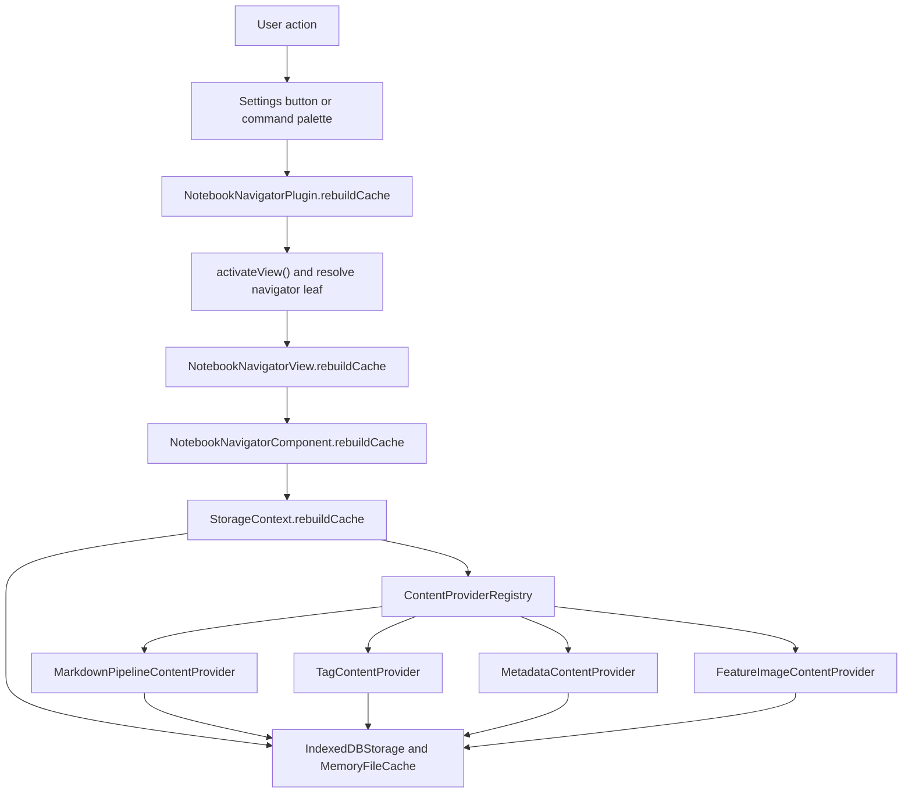
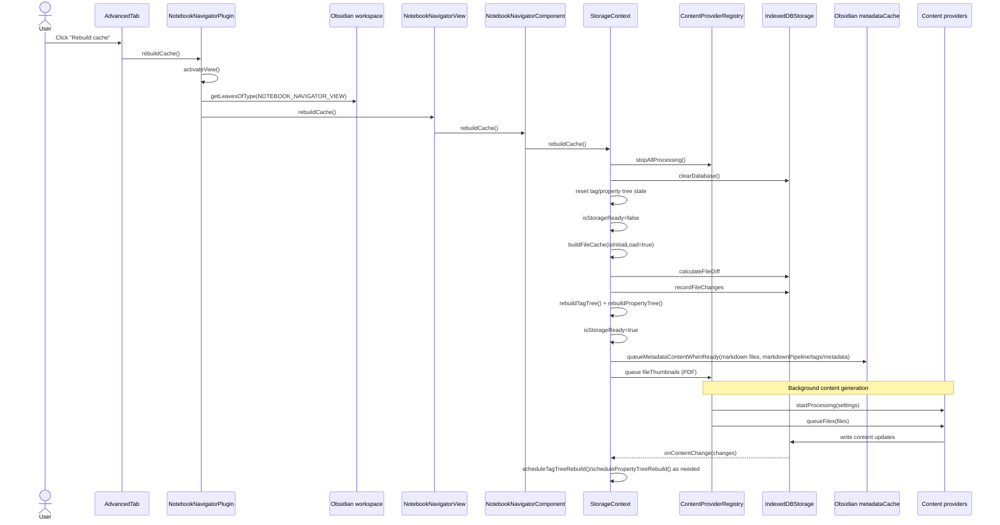
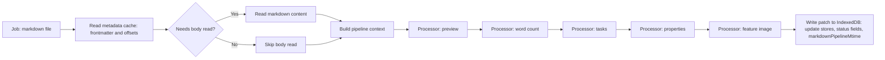

# Notebook Navigator metadata pipeline

Updated: February 18, 2026

## Table of contents

- [Overview](#overview)
- [Data model](#data-model)
- [Pipeline components](#pipeline-components)
- [Triggers](#triggers)
- [Vault sync](#vault-sync)
- [Derived content generation](#derived-content-generation)
- [Full cache rebuild](#full-cache-rebuild)
- [Markdown pipeline stages](#markdown-pipeline-stages)
- [Completion signals](#completion-signals)

## Overview

Notebook Navigator maintains a local file cache in IndexedDB and mirrors it into an in-memory cache for synchronous reads during rendering.

The pipeline has two layers:

- Vault sync: keep a `FileData` record for each indexable file path up to date with the vault state.
- Derived content: generate tags, frontmatter metadata, preview text, word count, task counters, property pills, and feature images using background content providers.
- Tree indexing: build tag and property trees from cached markdown metadata for navigation and selection.

The cache includes:

- File mtimes plus provider-specific processed mtimes
- Tags, frontmatter-derived metadata, word count, task counters, property pills
- Status fields for preview text and feature images, and stable source keys for feature images
- Preview text and feature image blobs stored in dedicated stores (status/key fields live in the main record)

## Data model

Notebook Navigator indexes markdown notes and PDFs (`src/utils/fileFilters.ts`, `getFilteredMarkdownAndPdfFiles()`).

Each indexed file path has a `FileData` record (`src/storage/IndexedDBStorage.ts`) containing:

- `mtime`: last observed vault mtime for the file
- Provider processed mtimes:
  - `markdownPipelineMtime`
  - `tagsMtime`
  - `metadataMtime`
  - `fileThumbnailsMtime`
- Provider outputs:
  - `tags`: extracted tags (`null` until extracted; markdown only)
  - `metadata`: extracted frontmatter metadata and hidden state (`null` until extracted; markdown only)
  - `wordCount`: word count (`null` until generated; markdown only)
  - `taskTotal` / `taskUnfinished`: task counters (`null` until generated; markdown only)
  - `properties`: resolved property pill list (`null` until generated; markdown only)

Defaults are set by `createDefaultFileData()` (`src/storage/IndexedDBStorage.ts`):

- Markdown: `tags=null`, `metadata=null`, `wordCount=null`, `taskTotal=null`, `taskUnfinished=null`, `properties=null`, `previewStatus='unprocessed'`
- PDF: `tags=[]`, `metadata={}`, `wordCount=0`, `taskTotal=0`, `taskUnfinished=0`, `properties=null`, `previewStatus='none'`

Preview text and feature images are stored separately and tracked through status fields:

- `previewStatus`:
  - `unprocessed`: markdown pipeline provider has not run yet
  - `none`: processed, no preview text stored
  - `has`: processed, preview text stored in the preview store
- `featureImageStatus`:
  - `unprocessed`: feature image provider has not run yet
  - `none`: processed, no thumbnail blob stored
  - `has`: processed, thumbnail blob stored in the blob store
- `featureImageKey` (stable source key):
  - `null`: not generated yet
  - `''`: processed and resolved to “no image”
  - `f:<path>@<mtime>`: local vault file reference (image embeds, PDF cover thumbnails)
  - `e:<url>`: external https URL reference (normalized, hash stripped)
  - `y:<videoId>`: YouTube thumbnail reference
  - `x:<path>@<mtime>`: Excalidraw thumbnail reference

The dedicated stores are cleared alongside the main file store during a full rebuild:

- Preview text store: keyed by file path (`previewStatus` tracks presence)
- Feature image blob store: keyed by file path (`featureImageStatus`/`featureImageKey` track presence and source)

## Pipeline components

- `StorageContext` (`src/context/StorageContext.tsx`) wires the storage hooks and exposes synchronous reads to the UI.
- Storage hooks (`src/context/storage/*`):
  - `useIndexedDBReady`: initializes IndexedDB and the in-memory mirror
  - `useInitializeContentProviderRegistry`: registers content providers
  - `useStorageVaultSync`: initial cache build, vault event handling, rename seeding, and file diffs
  - `useStorageContentQueue`: selects files that need derived content and queues providers
  - `useMetadataCacheQueue`: gates markdown providers on Obsidian metadata cache readiness
  - `useStorageSettingsSync`: reacts to settings changes and queues regeneration work
  - `useTagTreeSync`: builds the tag tree and schedules rebuilds when tags change
  - `usePropertyTreeSync`: builds the property tree and schedules rebuilds when properties or visibility rules change
  - `useStorageCacheRebuild`: implements the “Rebuild cache” action
  - `useCacheRebuildNotice`: shows and updates the rebuild progress notice
- `IndexedDBStorage` (`src/storage/IndexedDBStorage.ts`) persists file records and emits `onContentChange` notifications.
- `MemoryFileCache` (`src/storage/MemoryFileCache.ts`) mirrors file records (and small caches like preview text) for synchronous reads.
- `ContentProviderRegistry` (`src/services/content/ContentProviderRegistry.ts`) runs provider batches and coordinates settings changes.
- Content providers (`src/services/content/*`):
  - `MarkdownPipelineContentProvider` (`markdownPipeline`): preview, word count, task counters, property pills, markdown feature images
  - `TagContentProvider` (`tags`): tag extraction from Obsidian metadata cache
  - `MetadataContentProvider` (`metadata`): frontmatter metadata + hidden state
  - `FeatureImageContentProvider` (`fileThumbnails`): non-markdown feature images (PDF covers)

## Triggers

The metadata pipeline is driven by a mix of manual actions, vault events, metadata cache events, and settings changes:

- Startup: once IndexedDB initialization completes, the initial cache build runs (`useStorageVaultSync`).
- Vault sync:
  - `create` / `delete`: debounced diff using `calculateFileDiff()` and `recordFileChanges()` (`useStorageVaultSync`)
  - `rename`: seed/move cached artifacts, then schedule a diff to reconcile state (`useStorageVaultSync`)
  - `modify`: record the new mtime and queue derived content for that file (`useStorageVaultSync`)
- Obsidian metadata cache: `metadataCache.on('changed', file)` can trigger a regeneration pass even when vault mtimes did not update in the expected order (`markFilesForRegeneration()` resets provider processed mtimes and a re-queue follows).
- Settings changes: `ContentProviderRegistry.handleSettingsChange()` can stop providers, clear affected content, and re-queue regeneration (`useStorageSettingsSync`).
- Manual rebuild: Settings → Notebook Navigator → Advanced → Rebuild cache, or the `notebook-navigator:rebuild-cache` command.

## Vault sync

The file cache is seeded and kept up to date with a diff-based sync:

- `calculateFileDiff(currentFiles)` (`src/storage/diffCalculator.ts`) compares vault files to cached `FileData` records and returns:
  - `toAdd`: new paths
  - `toUpdate`: paths whose `file.stat.mtime` changed
  - `toRemove`: cached paths no longer present in the vault
- `recordFileChanges(files, cachedFiles, ...)` (`src/storage/fileOperations.ts`) updates the database:
  - New files: create default `FileData` with “unprocessed”/`null` markers for derived content
  - Modified files: patch only `mtime` and leave provider-owned fields intact, so existing derived content remains visible until providers regenerate
- `removeFilesFromCache(paths)` removes the file record and associated preview/blob store entries.

Renames are handled with a seed-and-move step before the diff runs:

- `useStorageVaultSync` seeds the new path in the in-memory cache and moves preview text / feature image blob store keys when applicable.
- After the move, it schedules a diff pass to reconcile the final file state and provider mtimes.

## Derived content generation

Derived content is generated by content providers managed by `ContentProviderRegistry` (`src/services/content/ContentProviderRegistry.ts`):

- Providers decide whether a file needs work by comparing their processed mtime field (`*Mtime`) to `file.stat.mtime` and checking status fields (`previewStatus`, `featureImageStatus`, `featureImageKey`, `tags`, `metadata`, `wordCount`, `taskTotal`, `taskUnfinished`, `properties`).
- Providers update content fields and their processed mtime in one IndexedDB transaction (`IndexedDBStorage.batchUpdateFileContentAndProviderProcessedMtimes`), and processed mtime updates are guarded to avoid overwriting forced regeneration resets.
- `markFilesForRegeneration()` (`src/storage/fileOperations.ts`) resets provider processed mtimes without clearing existing provider output fields, forcing providers to re-run against the current metadata cache/settings.
- Markdown providers are metadata-gated via `queueMetadataContentWhenReady(...)` (`useMetadataCacheQueue`), which tracks pending work per path and flushes it when `app.metadataCache.getFileCache(file)` is available.

## Full cache rebuild

The rebuild flow starts from Settings → Notebook Navigator → Advanced → Rebuild cache, or the `notebook-navigator:rebuild-cache` command.

### What gets queued after the database reset

- `IndexedDBStorage.clearDatabase()` clears:
  - File records
  - Preview text store
  - Feature image blob store
  - In-memory mirrors and LRU caches
- `buildFileCache(true)` (initial-load path in `useStorageVaultSync`) seeds the database by diffing against an empty cache:
  - New markdown records start with `tags=null`, `metadata=null`, `wordCount=null`, `taskTotal=null`, `taskUnfinished=null`, `properties=null`, and `previewStatus='unprocessed'`.
  - New PDF records start with `tags=[]`, `metadata={}`, `wordCount=0`, `taskTotal=0`, `taskUnfinished=0`, `properties=null`, and `previewStatus='none'`.
  - Feature image fields start as `featureImageStatus='unprocessed'` and `featureImageKey=null` for both markdown and PDF records.
- `queueMetadataContentWhenReady(...)` gates markdown providers on `app.metadataCache.getFileCache(file)`:
  - Filters to files that still need content based on status fields and processed mtimes.
  - Tracks pending work per file path and flushes it when Obsidian emits `metadataCache` `resolved`/`changed` events.
- PDF feature image generation is queued directly through the registry (`fileThumbnails`) when `showFeatureImage` is enabled.

## Markdown pipeline stages

`MarkdownPipelineContentProvider` runs a processor chain for markdown-derived outputs. Each processor inspects a shared context (settings, file data, frontmatter, optional file content) and returns a partial update.

Body reads are only performed when at least one output requires markdown content:

- Preview text extraction
- Word count (counts words from the markdown body start index)
- Feature image reference resolution from the note body (when not resolved from frontmatter)

The provider can also skip reads for large markdown files and still apply “safe” updates derived from frontmatter/metadata (for example, setting `wordCount=0` and clearing previews by writing an empty preview string).

Feature image references can be resolved from frontmatter without reading the note body. Exclusion rules (`featureImageExcludeProperties`) can force the “no image” marker (`featureImageKey=''`, `featureImageStatus='none'`).

## Completion signals

- Storage is ready when the initial diff + tag/property tree build completes and `StorageContext` sets `isStorageReady=true` (`useStorageVaultSync`).
- A rebuild is complete when the rebuild notice sees no remaining pending work across the tracked content types (`useCacheRebuildNotice`):
  - Preview: markdown files where `previewStatus === 'unprocessed'` (when preview tracking is enabled)
  - Tags: markdown files where `tags === null` (when tag tracking is enabled)
  - Metadata: markdown files where `metadata === null` (when metadata tracking is enabled)
  - Word count: markdown files where `wordCount === null` (always tracked)
  - Tasks: markdown files where `taskTotal === null` or `taskUnfinished === null` (always tracked)
  - Properties: markdown files where `properties === null` (when property tracking is enabled)
  - Feature image: files where `featureImageKey === null` or `featureImageStatus === 'unprocessed'` (when feature image tracking is enabled)
