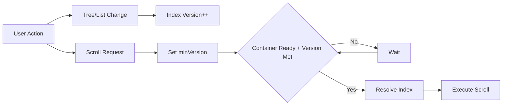

# Notebook Navigator Scroll Orchestration

Updated: February 18, 2026

## Table of Contents

- [Overview](#overview)
- [The Problem](#the-problem)
- [The Solution](#the-solution)
- [Core Concepts](#core-concepts)
  - [Index Versioning](#index-versioning)
  - [Pending Scrolls](#pending-scrolls)
  - [Intent-Based Scrolling](#intent-based-scrolling)
  - [Version Gating](#version-gating)
- [Architecture](#architecture)
  - [Shared Safeguards](#shared-safeguards)
  - [Navigation Pane Scrolling](#navigation-pane-scrolling)
  - [List Pane Scrolling](#list-pane-scrolling)
- [Common Scenarios](#common-scenarios)
  - [Toggling Hidden Items](#toggling-hidden-items)
  - [Folder Navigation](#folder-navigation)
  - [Settings and Layout Changes](#settings-and-layout-changes)
  - [Reveal Operations](#reveal-operations)
  - [Mobile Drawer Visibility](#mobile-drawer-visibility)
  - [Search Filtering](#search-filtering)
- [Implementation Details](#implementation-details)
  - [Priority System](#priority-system)
  - [Alignment Policies](#alignment-policies)
  - [Safe Viewport](#safe-viewport)
  - [Stabilization Mechanisms](#stabilization-mechanisms)
  - [Container Readiness](#container-readiness)
- [Debugging Guide](#debugging-guide)
  - [Observability](#observability)
  - [Common Issues](#common-issues)
  - [Key Debugging Points](#key-debugging-points)
- [See Also](#see-also)

## Overview

The scroll orchestration system coordinates TanStack Virtual lists in both panes. Each pane tracks structural changes,
defers scroll execution until data and DOM state are ready, and applies deterministic alignment for user-driven actions.

Primary implementation:

- `src/hooks/useNavigationPaneScroll.ts`
- `src/hooks/useListPaneScroll.ts`
- Shared helpers: `src/types/scroll.ts`, `src/utils/navigationIndex.ts`

## The Problem

Virtual lists rebuild whenever folder trees, list contents, or settings change. A rebuild invalidates cached indices
while scroll requests are still pending, so naive scrolling lands on the wrong item or fails silently.

### Race Condition Example

1. User has tag "todo" selected at index 61.
2. User toggles "Show hidden items".
3. Hidden tag "archived" becomes visible at index 40.
4. Tree rebuilds, "todo" is now at index 62.
5. Without orchestration: scroll uses stale index 61 and targets the wrong tag.
6. With orchestration: scroll waits for the rebuild, resolves the tag again, and hits index 62.

This kind of shift happens with visibility toggles, layout changes, sorting updates, folder/tag/property navigation, and asynchronous
metadata hydration.

## The Solution

Scroll orchestration combines version tracking, intent metadata, and priority coalescing.



Key principles:

1. Always resolve indices at execution time.
2. Increment pane-specific versions when index maps change.
3. Block scroll execution until the pane reports visible and the required version is reached.
4. Use intent metadata to pick alignment and (in the list pane) replace lower-priority requests.

## Core Concepts

### Index Versioning

Both panes maintain `indexVersionRef` counters.

- **Navigation pane** increments when the `pathToIndex` map changes size or identity.
- **List pane** increments when the `filePathToIndex` map changes size or identity and triggers `rowVirtualizer.measure()`
  so item heights stay current.

These counters allow pending scrolls to specify the version they require before execution.

### Pending Scrolls

Each pane stores at most one pending request.

- **Navigation pane** records `{ path, itemType, intent, align?, minIndexVersion? }`. Paths are normalized by item type.
- **List pane** records `{ type: 'file' | 'top', filePath?, reason?, minIndexVersion? }`.

A `pendingScrollVersion` state value forces React effects to re-run whenever a new request replaces the previous one.

### Intent-Based Scrolling

Intent metadata ties each request to its trigger and alignment policy.

- **Navigation intents**: `selection` is used for immediate selection scrolling (not stored as a pending scroll). Pending
  scrolls currently use `visibilityToggle`, `external`, and `mobile-visibility`. `startup` and `reveal` exist in the type
  but are not currently enqueued by `useNavigationPaneScroll`.
- **List intents**: `folder-navigation`, `visibility-change`, `reveal`, `list-structure-change`. `'top'` requests use
  the same priority system with `type: 'top'`.

### Version Gating

Scroll execution runs inside an effect that checks pane readiness and index versions.

```typescript
if (!pending || !isScrollContainerReady) {
  return;
}

const requiredVersion = pending.minIndexVersion ?? indexVersionRef.current;
if (indexVersionRef.current < requiredVersion) {
  return;
}

const index = resolveIndex(pending);
if (index >= 0) {
  virtualizer.scrollToIndex(index, { align: getAlign(pending.intent) });
  pendingScrollRef.current = null;
}
```

Navigation resolves via `getNavigationIndex`. List scrolls either use `scrollToIndex` or `scrollToOffset(0)` for top
requests.

## Architecture

### Shared Safeguards

- Both hooks use `ResizeObserver` to detect when the DOM container has width and height. Scrolls never run while the
  container or any parent is hidden.
- The composed `isScrollContainerReady` flag requires both logical visibility and physical dimensions.
- Both panes use TanStack Virtual `scrollMargin` and `scrollPaddingStart`/`scrollPaddingEnd` to align row math with
  overlay chrome and bottom overlays.
- In the list pane, mobile taps on the pane header call `handleScrollToTop`, which performs a smooth
  `scrollTo({ top: 0 })`.

### Navigation Pane Scrolling

`useNavigationPaneScroll` wires TanStack Virtual for navigation items (folders, tags, properties, shortcuts, recent notes, and
spacers).

- **Virtualizer setup**: Item height estimates follow navigation settings and mobile overrides. `scrollMargin` and
  `scrollPaddingStart`/`scrollPaddingEnd` align virtualization math and `scrollToIndex` below the pinned chrome stack
  and above bottom overlays.
- **Safe viewport adjustment**: `scrollToIndexSafely` runs `scrollToIndex` and then adjusts `scrollTop` to keep the
  rendered row between the pinned chrome stack and bottom overlays (calendar, mobile floating toolbar).
- **Selection handling**: The hook watches folder/tag/property selection, pane focus, and visibility. It suppresses auto-scroll
  when a shortcut is active or when `skipAutoScroll` is enabled for shortcut reveals.
- **Hidden item toggles**: When `showHiddenItems` changes, the current selection is queued with intent
  `visibilityToggle` and `minIndexVersion = current + 1`.
- **Tag/property selection**: Tag and property rows can load after folders, so selection scrolling for these types is handled in a dedicated effect.
- **Pending execution**: While a visibility toggle is in progress, only `visibilityToggle` requests can execute. After
  running such a scroll, the hook rechecks the index on the next animation frame and queues a follow-up if the index
  moved again.
- **External entries**: `requestScroll` normalizes the path and queues an `external` intent so reveal flows can drive
  the navigation pane.
- **Mobile drawer**: A `notebook-navigator-visible` event sets a pending scroll when the drawer becomes visible on
  mobile devices.
- **Settings changes**: Navigation sizing changes trigger `measure()` and an `auto` scroll to keep the selection within
  the safe viewport. Scroll inset changes (`scrollMargin`, `scrollPaddingEnd`) use the same `auto` scroll path.

### List Pane Scrolling

`useListPaneScroll` manages article lists, pinned groups, spacers, and date headers.

- **Virtualizer setup**: Height estimation mirrors `FileItem` logic, looking up preview availability synchronously and
  respecting compact mode. `scrollMargin` and `scrollPaddingStart`/`scrollPaddingEnd` keep scroll math aligned with
  overlay chrome and the mobile bottom toolbar.
- **Priority queue**: `setPending` wraps `rankListPending`, replacing lower-ranked requests.
- **Selected file tracking**: `selectedFilePathRef` avoids executing stale config scrolls for files that are no longer
  selected.
- **Selection index resolution**: `getSelectionIndex` returns the header index for the first file in the list when a
  header exists directly above it; otherwise it returns the file index.
- **Context tracking**: `contextIndexVersionRef` maintains the last version seen per folder/tag/property context. When the index
  advances within a folder, tag, or property context (pin/unpin, reorder, delete), the hook queues a `list-structure-change` scroll (when
  `revealFileOnListChanges` is enabled) so the selected file remains visible.
- **Folder navigation**: When the list context changes or `isFolderNavigation` is true, the hook sets a pending request
  (file or top) and clears the navigation flag. Pending entries can be queued even when the pane is hidden and execute
  once the list becomes ready.
- **Reveal operations**: Reveal flows queue a `reveal` pending scroll. Startup reveals override alignment to `'center'`.
- **Mobile drawer**: The `notebook-navigator-visible` event queues a visibility-change scroll when a file is selected.
- **Settings and search**: Appearance changes and descendant toggles queue `list-structure-change` entries. Search
  filters queue a `top` scroll when the selected file drops out of the filtered list, respecting mobile suppression
  flags.
- **Dynamic height updates**: The hook re-measures the list when list indices change and when the in-memory database
  reports preview, feature image, tag, metadata, or property updates.

## Common Scenarios

### Toggling Hidden Items

1. `showHiddenItems` flips in UX preferences.
2. The navigation hook increments `indexVersion`, defers selection scrolls with `intent: 'visibilityToggle'`, and waits
   for the next version.
3. After the tree rebuild, the pending scroll resolves the selection and runs.
4. The stabilization check revalidates the index on the next frame and queues another scroll if the index moved again.

### Folder Navigation

1. Selection context raises `isFolderNavigation` when the user picks a folder, tag, or property.
2. `useListPaneScroll` queues a file or top scroll with reason `folder-navigation` and clears the flag.
3. `getListAlign` centers the selection on mobile and uses `auto` on desktop.
4. The navigation pane independently scrolls to the selected folder/tag/property row when the pane becomes focused or visible.

### Settings and Layout Changes

1. Navigation line height or indentation updates trigger `rowVirtualizer.measure()` followed by a deferred selection
   scroll when auto-scroll is allowed.
2. List appearance or descendant toggles queue a `list-structure-change` scroll with `minIndexVersion = current + 1`
   when `revealFileOnListChanges` is enabled and a file is selected. Disabling descendants can queue a `top` scroll
   when no file is selected or `revealFileOnListChanges` is disabled.
3. Reorders within the same folder/tag/property context update `indexVersion` and enqueue a `list-structure-change` scroll so the
   selected file remains visible.

### Reveal Operations

1. Reveal flows call `requestScroll` for the navigation pane and set `selectionState.isRevealOperation`.
2. The navigation pane scrolls as an `external` request (alignment from `getNavAlign('external')`, `auto` by default).
3. The list pane queues a `reveal` request and scrolls once the index is ready. Startup reveals center the target item;
   manual reveals use `auto`.

### Mobile Drawer Visibility

1. The mobile drawer raises the `notebook-navigator-visible` event when opened.
2. Navigation queues a `mobile-visibility` scroll for the current selection.
3. The list pane queues a `visibility-change` scroll for the selected file, preserving context when the drawer becomes
   visible.

### Search Filtering

1. When search filters remove the selected file, the list pane detects that the file path is absent from
   `filePathToIndex`.
2. Unless suppressed for mobile shortcuts, the hook queues a `top` scroll with reason `list-structure-change`.
3. If the selected file remains in the results, folder navigation effects keep it visible without extra scroll requests.

## Implementation Details

### Priority System

List pane priorities live in `rankListPending`:

```typescript
export function rankListPending(p?: { type: 'file' | 'top'; reason?: ListScrollIntent }): number {
  if (!p) return -1;
  if (p.type === 'top') return 0;
  switch (p.reason) {
    case 'list-structure-change':
      return 1;
    case 'visibility-change':
      return 2;
    case 'folder-navigation':
      return 3;
    case 'reveal':
      return 4;
    default:
      return 1;
  }
}
```

`setPending` compares these ranks and only replaces the current request when the new one is equal or higher.

### Alignment Policies

- **Navigation pane**: `selection` centers on mobile and uses `auto` on desktop. `visibilityToggle`, `external`, and
  `mobile-visibility` use `auto`. `startup` defaults to `center` and `reveal` maps to `auto` in `getNavAlign`.
- **List pane**: `folder-navigation` centers on mobile, others use `auto`. Startup reveals override to `center` after
  execution.

### Safe Viewport

- Both panes pass scroll insets to TanStack Virtual (`scrollMargin`, `scrollPaddingStart`, `scrollPaddingEnd`) so row
  offsets and `scrollToIndex` align with overlay chrome.
- Navigation runs a post-scroll adjustment step (`ensureIndexNotCovered`) that clamps the target row between the safe
  top and bottom bounds, retrying for a few animation frames while virtualization settles.

### Stabilization Mechanisms

- Navigation visibility toggles run a `requestAnimationFrame` check after scrolling to detect secondary rebuilds and
  queue another pending request if needed.
- List `list-structure-change` scrolls run a similar frame-based check and queue a follow-up when the index changes
  again (only when `revealFileOnListChanges` is enabled).

### Container Readiness

- `scrollContainerRefCallback` stores the DOM node and updates a local state reference.
- `ResizeObserver` (or a window resize fallback) tracks the node's size.
- `isScrollContainerReady` gates all scroll execution paths, preventing TanStack Virtual scroll calls while the
  container (or a parent) is hidden.

## Debugging Guide

### Observability

- Add temporary `console.log` statements near `setPending`, pending execution effects, and version increments. Obsidian
  ignores `console.debug`, so use `console.log`.
- The hooks include comment tags (`NAV_SCROLL_*`, `SCROLL_*`) marking where to instrument logs.

### Common Issues

**Scroll lands on wrong item**

- Confirm `minIndexVersion` is set to `indexVersionRef.current + 1` when a rebuild is pending.
- Ensure the path resolves through `getNavigationIndex` or `getSelectionIndex`.

**Scroll does not execute**

- Verify `isScrollContainerReady` is true.
- Check that the pending entry still matches the current selection.
- Confirm the required version has been reached.

**Multiple scrolls conflict**

- Inspect `rankListPending` decisions to see which request displaced another.
- For navigation, confirm visibility-toggle guards are not blocking unrelated intents.

### Key Debugging Points

1. Log every `indexVersionRef` increment to correlate rebuilds with pending execution.
2. Log path-to-index resolution results to confirm indices match expectations.
3. Log pending intent, required version, and alignment when the execution effect runs.
4. Log priority comparisons inside `setPending` to see why a request was replaced or kept.

## See Also

- [Service Architecture](./service-architecture.md)
- [Startup Process](./startup-process.md)
- [Storage Architecture](./storage-architecture.md)
