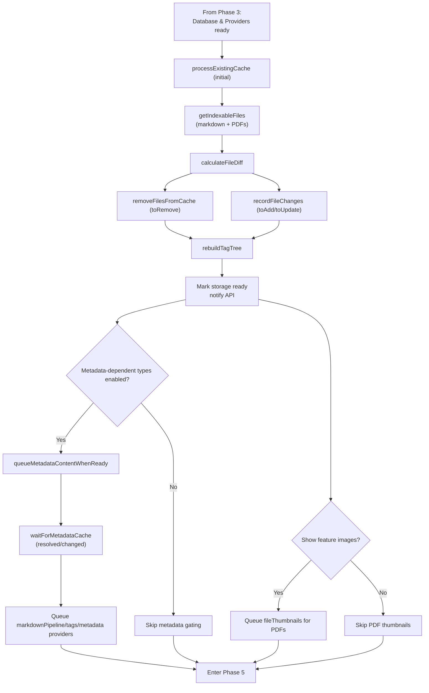

# Notebook Navigator Startup Process

Updated: January 8, 2026

## Table of Contents

- [Overview](#overview)
- [Key Concepts](#key-concepts)
  - [Cold Boot](#cold-boot)
  - [Warm Boot](#warm-boot)
  - [Version System](#version-system)
- [Startup Phases](#startup-phases)
  - [Phase 1: Plugin Registration](#phase-1-plugin-registration-maints)
  - [Phase 2: View Creation](#phase-2-view-creation-notebooknavigatorviewtsx)
  - [Phase 3: Database Version Check](#phase-3-database-version-check-and-initialization)
  - [Phase 4: Initial Data Load](#phase-4-initial-data-load-and-metadata-resolution)
  - [Phase 5: Background Processing](#phase-5-background-processing)
- [Critical Timing Mechanisms](#critical-timing-mechanisms)
  - [Deferred Scheduling](#deferred-scheduling)
  - [Debouncing](#debouncing)

## Overview

The Notebook Navigator plugin has a multi-phase startup process that handles data synchronization and content
generation. The startup behavior differs between cold boots (first launch) and warm boots (subsequent launches).

## Key Concepts

### Cold Boot

A **cold boot** occurs when:

- The plugin is installed for the first time
- The IndexedDB cache doesn't exist or is cleared
- Database version markers are missing in vault-scoped localStorage
- `DB_CONTENT_VERSION` has changed
- A schema downgrade or incompatible migration requires a rebuild

Characteristics:

- Full database initialization required
- All files need content generation
- Database is either created new or cleared completely

### Warm Boot

A **warm boot** occurs when:

- Obsidian is restarted with the plugin already enabled
- The plugin is enabled after being disabled
- Database exists with valid schema and content versions

Characteristics:

- Database already exists with cached data
- Only changed files need processing
- Metadata cache is typically ready immediately

### Version System

The plugin uses two version numbers to manage database state:

**DB_SCHEMA_VERSION**: Controls the IndexedDB structure

- Changes when database schema is modified (new indexes, stores, etc.)
- Used as the version passed to `indexedDB.open(...)`
- Upgrades run via `onupgradeneeded` (stores/indexes/migrations); some upgrades clear legacy payloads to force a rebuild
- Downgrades delete the database and rebuild

**DB_CONTENT_VERSION**: Controls the data format

- Changes when content structure or generation logic is modified
- Triggers data clearing but preserves database structure
- Examples: changing how previews are generated, tag extraction logic updates

Both versions are stored in localStorage to detect changes between sessions.

Version mismatches can result in a cold boot (empty `MemoryFileCache` + cleared stores) so providers regenerate content.

## Startup Phases

### Phase 1: Plugin Registration (main.ts)

**Trigger**: Obsidian calls Plugin.onload() when enabling the plugin

1. Obsidian calls `Plugin.onload()`.
2. Initialize vault-scoped localStorage (`localStorage.init`) before any database work.
3. Initialize IndexedDB early via `initializeDatabase(appId, ...)`.
   - Starts `db.init()` (schema check + `MemoryFileCache` hydration) before views mount.
   - Operation is idempotent to support rapid enable/disable cycles.
4. Load settings from `data.json` and run migrations.
   - Sanitize keyboard shortcuts and migrate legacy fields.
   - Apply default date/time formats and normalize folder note properties.
   - Load dual-pane orientation and UX preferences from localStorage.
5. Handle first-launch setup when no saved data exists.
   - Normalize tag settings, clear vault-scoped localStorage keys, and expand the root folder.
   - Reset dual-pane orientation and UX preferences to defaults.
   - Record the current localStorage schema version for future migrations.
6. Initialize recent data and UX tracking.
   - `RecentDataManager` loads persisted recent notes and icons.
   - `RecentNotesService` starts recording file-open history.
7. Construct core services and controllers:
   - `WorkspaceCoordinator` and `HomepageController` manage view activation and homepage flow.
   - `MetadataService`, `TagOperations`, `TagTreeService`, and `CommandQueueService`.
   - `FileSystemOperations` wired with tag tree and visibility preferences.
   - `OmnisearchService`, `NotebookNavigatorAPI`, and `ReleaseCheckService`.
   - `ExternalIconProviderController` initializes icon providers and syncs settings.
8. Register view, commands, settings tab, and workspace integrations.
   - `registerNavigatorCommands` wires command palette entries.
   - `registerWorkspaceEvents` adds editor context menu actions, the ribbon icon, recent-note tracking, and
     rename/delete handlers.
9. Wait for `workspace.onLayoutReady()`.
   - `HomepageController.handleWorkspaceReady()` activates the view on first launch and opens the configured homepage
     when available.
   - Triggers Style Settings parsing, version notice checks, and optional release polling.

### Phase 2: View Creation (NotebookNavigatorView.tsx)

**Trigger**: activateView() creates the view via workspace.getLeaf()

1. Obsidian calls onOpen() when view is created
2. React app mounts with the following context providers:
   - `SettingsProvider` (settings state and update actions)
   - `UXPreferencesProvider` (dual-pane and search preferences synced with the plugin)
   - `RecentDataProvider` (recent notes and icon lists)
   - `ServicesProvider` (Obsidian app, services, and platform flags)
   - `ShortcutsProvider` (pinned shortcut hydration and operations)
   - `StorageProvider` (IndexedDB access and content pipeline)
   - `ExpansionProvider` (expanded folders and tags)
   - `SelectionProvider` (selected items plus rename listeners from the plugin)
   - `UIStateProvider` (pane focus and layout mode)
3. Container renders skeleton view while storage initializes:
   - Shows placeholder panes with saved dimensions
   - Provides immediate visual feedback
   - Prevents layout shift when data loads
4. Mobile detection adds platform-specific class and determines UI layout:
   - Adds `notebook-navigator-mobile` and platform classes (`notebook-navigator-android`, `notebook-navigator-ios`)
   - Android applies font scaling compensation before React renders
   - Desktop: NavigationPaneHeader and ListPaneHeader at top of panes
   - Mobile: NavigationToolbar and ListToolbar at bottom of panes
   - Touch optimizations and swipe gestures enabled on mobile

### Phase 3: Database Version Check and Initialization

**Trigger**: Database initialization starts in Phase 1 and StorageContext awaits readiness

1. StorageContext retrieves the shared database instance.
   - Calls `getDBInstance()` and awaits `db.init()` (`useIndexedDBReady`).
   - Logs and keeps the flag false if initialization fails.
2. `IndexedDBStorage.init()` handles schema and content version checks.
   - Reads stored versions from vault-scoped localStorage.
   - Runs schema upgrades via `onupgradeneeded` and deletes the database on schema downgrades or open errors.
   - Clears stores when version markers are missing or `DB_CONTENT_VERSION` changes.
   - Persists the current versions back to localStorage.
3. Database opening and cache hydration:
   - Rebuilds start with an empty `MemoryFileCache`.
   - Warm boots load all records into the cache for synchronous access.
4. StorageContext creates a `ContentProviderRegistry` once and registers:
   - `MarkdownPipelineContentProvider` (`markdownPipeline`)
   - `FeatureImageContentProvider` (`fileThumbnails`)
   - `MetadataContentProvider` (`metadata`)
   - `TagContentProvider` (`tags`)
5. With `isIndexedDBReady` true, Phase 4 processing can begin.

#### Cold Boot Path (database empty or cleared):

1. Database is deleted or cleared during initialization.
2. `MemoryFileCache` starts empty because no cached data exists.
3. Providers remain idle until Phase 4 queues work.
4. Continue to Phase 4 with an empty database snapshot.

#### Warm Boot Path (database has existing data):

1. Database opens without recreation.
2. All records load into `MemoryFileCache`.
3. Providers have immediate access to cached content.
4. Continue to Phase 4 with populated data.

### Phase 4: Initial Data Load and Metadata Resolution

**Trigger**: Database initialization completes (from Phase 3)

This phase handles the initial synchronization between the vault and the database, then ensures metadata is ready for
tag extraction and markdown pipeline processing:

#### Initial load (`isInitialLoad=true`)

1. Gather indexable files with `getIndexableFiles()` (`getFilteredMarkdownAndPdfFiles()`).
2. Calculate diffs through `calculateFileDiff()`.
   - Cold boot: all files appear as new (database cache is empty)
   - Warm boot: compare against cached data to find new/modified files
3. Apply the diff:
   - Remove deleted paths via `removeFilesFromCache(toRemove)`.
   - Upsert new/modified files via `recordFileChanges([...toAdd, ...toUpdate], cachedFiles, pendingRenameData)`.
     - New files use `createDefaultFileData` (provider processed mtimes set to `0`, status fields set to `unprocessed`,
       markdown `tags` set to `null`).
     - Modified files patch the stored `mtime` without clearing existing provider outputs. Providers compare their
       processed mtime fields (`markdownPipelineMtime`, `tagsMtime`, `metadataMtime`, `fileThumbnailsMtime`) against
       `file.stat.mtime` to detect stale content.
4. Rebuild tag tree via `rebuildTagTree()` (`buildTagTreeFromDatabase`).
5. Mark storage as ready (`setIsStorageReady(true)` and `NotebookNavigatorAPI.setStorageReady(true)`).
6. Queue content generation:
   - Determine metadata-dependent provider types with `getMetadataDependentTypes(settings)` (`markdownPipeline`, `tags`, `metadata`).
   - `queueMetadataContentWhenReady(markdownFiles, metadataDependentTypes, settings)` filters to files needing work, waits for
     Obsidian's metadata cache (`resolved` and `changed`), then queues providers in `ContentProviderRegistry`.
   - When `showFeatureImage` is enabled, queue the `fileThumbnails` provider for PDFs (filtered by `filterPdfFilesRequiringThumbnails`).

#### Ongoing sync (`isInitialLoad=false`)

- Vault events debounce a cache rebuild.
- Diff processing is deferred with a zero-delay `setTimeout` and uses the same `calculateFileDiff` + `recordFileChanges` /
  `removeFilesFromCache` flow.
- When files are removed and tags are enabled, tag tree rebuild is scheduled.

#### Data Flow Diagram

The metadata cache gating is managed by `queueMetadataContentWhenReady()` (which uses `waitForMetadataCache`) and queues
metadata-dependent providers once Obsidian metadata cache entries exist:

#### Metadata Cleanup

**Purpose**: Remove orphaned metadata for folders, tags, and files deleted or renamed outside of Obsidian. Metadata
cleanup is performed manually from settings.

**When It's Needed**:

- Files/folders deleted directly from file system
- Files/folders renamed outside of Obsidian
- Vault synchronized with missing or renamed files
- Files renamed or deleted by external tools or scripts
- After major vault reorganization outside Obsidian
- Sync conflicts that resulted in orphaned metadata

**How to Run**: Open Settings → Notebook Navigator → Advanced → Clean up metadata

**What Gets Cleaned**:

- Folder colors, icons, sort settings, and background colors for deleted/renamed folders
- Tag colors, icons, sort settings, and background colors for removed tags
- Pinned notes that no longer exist
- Custom appearances for non-existent items

**Technical Details**: The cleanup process uses validators to compare stored metadata against the current vault state.
See `MetadataService.cleanupAllMetadata()` and `MetadataService.getCleanupSummary()` for implementation.

### Phase 5: Background Processing

**Trigger**: Files queued by ContentProviderRegistry (from Phase 4)

Content is generated asynchronously in the background by the ContentProviderRegistry and individual providers:

1. **File Detection**: Each provider checks if files need processing
   - TagContentProvider: `tags === null` or `tagsMtime !== file.stat.mtime`
   - MarkdownPipelineContentProvider: `markdownPipelineMtime !== file.stat.mtime`, `previewStatus/featureImageStatus === 'unprocessed'`, or `customProperty === null`
   - FeatureImageContentProvider: `fileThumbnailsMtime !== file.stat.mtime` or missing/mismatched `featureImageKey`
   - MetadataContentProvider: `metadata === null` or `metadataMtime !== file.stat.mtime`

2. **Queue Management**: Files are queued based on enabled settings
   - ContentProviderRegistry manages the queue
   - Processes files in batches to avoid blocking UI
   - Uses deferred scheduling for background processing
   - `queueMetadataContentWhenReady()` delays metadata-dependent providers (markdown pipeline, tags, metadata) until Obsidian's metadata cache has entries

3. **Processing**: Each provider processes files independently
   - TagContentProvider: Extracts tags from Obsidian's metadata cache (`getAllTags(metadata)`)
   - MarkdownPipelineContentProvider: Uses metadata cache for frontmatter/offsets, reads markdown content when needed, runs preview/custom property/feature image processors
   - FeatureImageContentProvider: Generates thumbnails for non-markdown files (PDF cover thumbnails)
   - MetadataContentProvider: Extracts configured frontmatter fields and hidden state from Obsidian's metadata cache

4. **Database Updates**: Results stored in IndexedDB
   - Each provider returns updates to IndexedDBStorage
   - Database fires content change events

5. **Memory Sync**: MemoryFileCache automatically synced with IndexedDB changes

6. **UI Updates**: StorageContext listens for database changes
   - Tag changes trigger tag tree rebuild (buildTagTreeFromDatabase)
   - Components re-render with new content via React context

#### Cache rebuild progress notice

The cache rebuild progress notice tracks background provider work during a full cache rebuild.

- Rebuild start persists a vault-scoped localStorage marker (`STORAGE_KEYS.cacheRebuildNoticeKey`) with the initial file count.
- On the next startup, StorageContext restores the notice after storage is marked ready and uses current settings to determine which content types to track.
- The marker is cleared when the notice detects that all tracked content types have no pending work.

## Critical Timing Mechanisms

### Deferred Scheduling

StorageContext defers non-blocking work with `setTimeout`, keeping the UI responsive:

- Schedules background batches with zero-delay timeouts
- Works across desktop, mobile, and Safari
- Used for background processing and cleanup

### Debouncing

The plugin uses a single debouncing approach based on Obsidian's built‑in `debounce` utility. It is applied consistently
across vault events and UI updates to coalesce rapid event bursts and avoid redundant work.

- Scope: vault events (create, delete, rename, modify) and UI flows (list refresh, tree rebuilds, focus changes)
- Mechanism: `debounce(handler, timeout, options)` from the Obsidian API
- Goal: reduce repeated processing and unnecessary re-renders when events arrive in quick succession

## Shutdown Process

### Phase 1: Plugin Unload (main.ts)

**Trigger**: Obsidian calls Plugin.onunload() when disabling the plugin

1. Set the `isUnloading` flag to prevent new operations from starting.
2. Dispose runtime managers that watch local storage and external providers.
   - `RecentDataManager.dispose()` stops persistence sync.
   - `ExternalIconProviderController.dispose()` releases icon provider hooks.
3. Clear listener maps to avoid callbacks during teardown:
   - Settings update listeners
   - File rename listeners
   - Recent data listeners
4. Release service instances:
   - `MetadataService` and `TagOperations` references set to `null`
   - `CommandQueueService.clearAllOperations()` then set to `null`
   - `OmnisearchService` reference cleared
   - `RecentDataManager` reference cleared after disposal
5. Stop content processing in every navigator leaf:
   - Iterate leaves via `getLeavesOfType(NOTEBOOK_NAVIGATOR_VIEW)`
   - Call `stopContentProcessing()` on each view to halt the `ContentProviderRegistry`
6. Remove the ribbon icon element.
7. Call `shutdownDatabase()` to:
   - Close the IndexedDB connection
   - Clear the in-memory cache
   - Keep the operation idempotent for repeated unloads

### Phase 2: View Cleanup (NotebookNavigatorView.tsx)

**Trigger**: View.onClose() when view is destroyed

1. Remove CSS classes from container:
   - notebook-navigator
   - notebook-navigator-mobile (if applicable)
   - notebook-navigator-android / notebook-navigator-ios (if applicable)
2. Unmount React root:
   - Call root.unmount()
   - Set root to null
3. StorageContext cleanup (via useEffect return):
   - Stop all content processing in ContentProviderRegistry
   - Cancel any pending timers
   - Prevent setState calls after unmount

### Key Principles

1. **Clear Ownership**: Plugin owns database lifecycle, not React components
2. **Processing Before Shutdown**: Always stop content providers before closing database
3. **Idempotent Operations**: Both initializeDatabase and shutdownDatabase are safe to call multiple times
4. **Prevent Late Operations**: isUnloading flag prevents new operations during shutdown
5. **Clean Separation**: Database lifecycle is separate from view lifecycle
