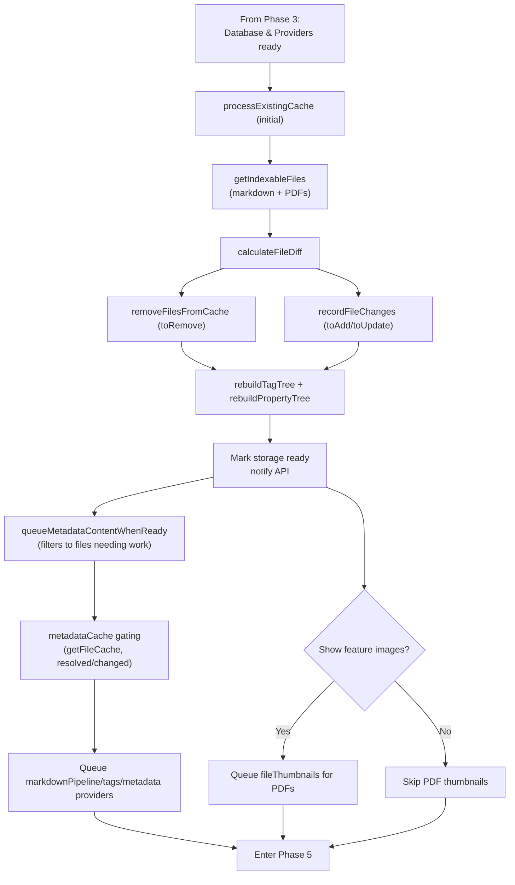

# Notebook Navigator Startup Process

Updated: February 18, 2026

## Table of Contents

- [Overview](#overview)
- [Key Concepts](#key-concepts)
  - [Cold Boot](#cold-boot)
  - [Warm Boot](#warm-boot)
  - [Workspace Layout Restore](#workspace-layout-restore)
  - [Version System](#version-system)
- [Startup Phases](#startup-phases)
  - [Phase 1: Plugin Registration](#phase-1-plugin-registration-maints)
  - [Phase 2: View Creation](#phase-2-view-creation)
  - [Phase 3: Database Version Check](#phase-3-database-version-check-and-initialization)
  - [Phase 4: Initial Data Load](#phase-4-initial-data-load-and-metadata-resolution)
  - [Phase 5: Background Processing](#phase-5-background-processing)
- [Critical Timing Mechanisms](#critical-timing-mechanisms)
  - [Deferred Scheduling](#deferred-scheduling)
  - [Debouncing](#debouncing)
- [Shutdown Process](#shutdown-process)
  - [Phase 1: Plugin Unload](#phase-1-plugin-unload-maints)
  - [Phase 2: View Cleanup](#phase-2-view-cleanup)
  - [Key Principles](#key-principles)

## Overview

The Notebook Navigator plugin has a multi-phase startup process that handles data synchronization and content
generation. The startup behavior differs between cold boots (empty/cleared cache) and warm boots (existing cache).

## Key Concepts

### Cold Boot

A **cold boot** occurs when:

- The plugin is installed for the first time
- The IndexedDB cache doesn't exist or is cleared
- Database version markers are missing in vault-scoped localStorage
- `DB_CONTENT_VERSION` has changed
- A schema downgrade or incompatible migration requires a rebuild

Characteristics:

- Full database initialization required
- All files need content generation
- Database is either created new or cleared completely

### Warm Boot

A **warm boot** occurs when:

- Obsidian is restarted with the plugin already enabled
- The plugin is enabled after being disabled
- Database exists with valid schema and content versions

Characteristics:

- Database already exists with cached data
- Only changed files and files missing derived content need processing
- Metadata cache is populated asynchronously; metadata-dependent providers wait for `metadataCache` entries

### Workspace Layout Restore

Obsidian can restore open tabs/leaves from the saved workspace layout.

For Notebook Navigator this matters because:

- On warm boots, the navigator view is often created by layout restore (not by `activateView()`).
- When `calendarPlacement` is `right-sidebar`, the calendar sidebar leaf is restored and managed independently of navigator leaves.
- On first launch, the plugin explicitly activates the view in `HomepageController.handleWorkspaceReady()` after
  `workspace.onLayoutReady()`.

### Version System

The plugin uses two version numbers to manage database state:

**DB_SCHEMA_VERSION**: Controls the IndexedDB structure

- Changes when database schema is modified (new indexes, stores, etc.)
- Used as the version passed to `indexedDB.open(...)`
- Upgrades run via `onupgradeneeded` (stores/indexes/migrations); some upgrades clear legacy payloads to force a rebuild
- Downgrades delete the database and rebuild

**DB_CONTENT_VERSION**: Controls the data format

- Changes when content structure or generation logic is modified
- Triggers data clearing but preserves database structure
- Examples: changing how previews are generated, tag extraction logic updates

Both versions are stored in localStorage to detect changes between sessions.

Version mismatches can result in a cold boot (empty `MemoryFileCache` + cleared stores) so providers regenerate content.
Schema downgrades and content version changes also set a pending rebuild notice that is consumed by StorageContext to
show progress.

## Startup Phases

### Phase 1: Plugin Registration (main.ts)

**Trigger**: Obsidian calls Plugin.onload() when enabling the plugin

1. Obsidian calls `Plugin.onload()`.
2. Initialize vault-scoped localStorage (`localStorage.init`) before any database work.
3. Register the plugin icon with Obsidian (`addIcon(...)`).
4. Initialize IndexedDB early via `initializeDatabase(appId, ...)`.
   - Starts `db.init()` (schema check + `MemoryFileCache` hydration) asynchronously before views mount.
   - Operation is idempotent to support rapid enable/disable cycles.
   - Starts preview text warmup (`startPreviewTextWarmup`) after init.
5. Load settings from `data.json` and run migrations.
   - Sanitize keyboard shortcuts and migrate legacy fields.
   - Apply default date/time formats and migrate folder note template settings.
   - Load UX preferences from vault-scoped localStorage.
6. Handle first-launch setup when no saved data exists.
   - Normalize tag settings and clear vault-scoped localStorage keys (preserving IndexedDB version markers).
   - Re-seed per-device localStorage mirrors for sync-mode settings and UX preferences.
   - Expand the root folder when `showRootFolder` is enabled.
   - Persist the current localStorage version (`LOCALSTORAGE_VERSION`).
7. Initialize recent data and UX tracking.
   - `RecentDataManager` loads persisted recent notes and icons.
   - `RecentNotesService` starts recording file-open history.
8. Construct core services and controllers:
   - `WorkspaceCoordinator` and `HomepageController` manage view activation and homepage flow.
   - `MetadataService`, `TagOperations`, `TagTreeService`, `PropertyTreeService`, and `CommandQueueService`.
   - `FileSystemOperations` wired with tag tree, property tree, and visibility preferences.
   - `OmnisearchService`, `NotebookNavigatorAPI`, and `ReleaseCheckService`.
   - `ExternalIconProviderController` initializes icon providers and syncs settings.
9. Register view, commands, settings tab, and workspace integrations.
   - Register both `NOTEBOOK_NAVIGATOR_VIEW` (`NotebookNavigatorView`) and
     `NOTEBOOK_NAVIGATOR_CALENDAR_VIEW` (`NotebookNavigatorCalendarView`).
   - `registerNavigatorCommands` wires command palette entries.
   - `registerWorkspaceEvents` adds editor context menu actions, the ribbon icon, recent-note tracking, and
     rename/delete handlers.
10. Wait for `workspace.onLayoutReady()`.
   - `HomepageController.handleWorkspaceReady()` activates the view on first launch and opens the configured homepage (if set).
   - On first launch, the Welcome modal is opened after the workspace is ready.
   - Triggers Style Settings parsing, version notice checks, and optional release polling.
   - `applyCalendarPlacementView({ force: true, reveal: false })` syncs the calendar right-sidebar leaf with `settings.calendarPlacement`.

### Phase 2: View Creation

**Trigger**: Obsidian restores leaves from workspace layout, the plugin calls `activateView()` (commands/ribbon/menu),
or calendar placement changes run after layout/settings updates.

#### Navigator view (`NotebookNavigatorView.tsx`)

`activateView()` delegates to `WorkspaceCoordinator.activateNavigatorView()`:

- Reveals the first existing navigator leaf (when one exists).
- Otherwise creates a new left-sidebar leaf via `workspace.getLeftLeaf(false)` and `leaf.setViewState({ type: NOTEBOOK_NAVIGATOR_VIEW, active: true })`.

1. Obsidian calls `NotebookNavigatorView.onOpen()` when the view is created/restored.
2. React app mounts with the following context providers:
   - `SettingsProvider` (settings state and update actions)
   - `UXPreferencesProvider` (dual-pane and search preferences synced with the plugin)
   - `RecentDataProvider` (recent notes and icon lists)
   - `ServicesProvider` (Obsidian app, services, and platform flags)
   - `ShortcutsProvider` (pinned shortcut hydration and operations)
   - `StorageProvider` (IndexedDB access and content pipeline)
   - `ExpansionProvider` (expanded folders, tags, and properties)
   - `SelectionProvider` (selected items plus rename listeners from the plugin)
   - `UIStateProvider` (pane focus and layout mode)
3. `NotebookNavigatorContainer` renders a skeleton until `StorageContext.isStorageReady` is true.
4. `NotebookNavigatorView.onOpen()` adds platform classes and (on Android) applies font scaling compensation before React renders:
   - Always adds `notebook-navigator`.
   - Adds `notebook-navigator-mobile` and platform classes on mobile (`notebook-navigator-android`, `notebook-navigator-ios`).
   - Adds `notebook-navigator-obsidian-1-11-plus-*` when `requireApiVersion('1.11.0')` passes.
5. Pane chrome uses headers on all platforms and toolbars on mobile:
   - `NavigationPaneHeader` and `ListPaneHeader` render at the top of the scroll content area.
   - Android mobile renders `NavigationToolbar` / `ListToolbar` at the top.
   - iOS mobile renders `NavigationToolbar` / `ListToolbar` in a bottom toolbar container.

#### Calendar right sidebar view (`NotebookNavigatorCalendarView.tsx`)

1. `applyCalendarPlacementView()` evaluates `settings.calendarPlacement` after layout readiness and on settings updates.
2. When placement is `right-sidebar`, it calls `WorkspaceCoordinator.ensureCalendarViewInRightSidebar(...)`.
3. Obsidian calls `NotebookNavigatorCalendarView.onOpen()` when the calendar leaf is created/restored.
4. React app mounts with:
   - `SettingsProvider`
   - `ServicesProvider`
   - `CalendarRightSidebar`
5. `CalendarRightSidebar` renders `Calendar` with `weeksToShowOverride={6}` and forwards date-filter actions to the navigator view.
6. When placement changes away from `right-sidebar`, `WorkspaceCoordinator.detachCalendarViewLeaves()` removes calendar leaves.

### Phase 3: Database Version Check and Initialization

**Trigger**: Database initialization starts in Phase 1 and StorageContext awaits readiness

1. StorageContext retrieves the shared database instance.
   - Calls `getDBInstance()` and awaits `db.init()` (`useIndexedDBReady`).
   - Logs and keeps the flag false if initialization fails.
2. `IndexedDBStorage.init()` handles schema and content version checks.
   - Reads stored versions from vault-scoped localStorage.
   - Runs schema upgrades via `onupgradeneeded` and deletes the database on schema downgrades or open errors.
   - Opens the database with `skipCacheLoad=true` and clears stores when version markers are missing, `DB_CONTENT_VERSION`
     changes, or a schema downgrade is detected.
   - Sets a pending rebuild notice when a schema downgrade or `DB_CONTENT_VERSION` change is detected (not when keys are missing).
   - Persists the current versions back to localStorage.
3. Database opening and cache hydration:
   - Rebuilds start with an empty `MemoryFileCache`.
   - Warm boots load all records into the cache for synchronous access.
   - IndexedDB stores:
     - `keyvaluepairs`: file records (`FileData`) excluding preview text and blob payloads
     - `filePreviews`: preview text strings keyed by path (loaded on demand / warmup)
     - `featureImageBlobs`: thumbnail blobs keyed by path (cached in an in-memory LRU)
4. StorageContext creates a `ContentProviderRegistry` once and registers:
   - `MarkdownPipelineContentProvider` (`markdownPipeline`)
   - `FeatureImageContentProvider` (`fileThumbnails`)
   - `MetadataContentProvider` (`metadata`)
   - `TagContentProvider` (`tags`)
5. With `isIndexedDBReady` true, Phase 4 processing can begin.

#### Cold Boot Path (database empty or cleared):

1. Database is deleted or cleared during initialization.
2. `MemoryFileCache` starts empty because no cached data exists.
3. Providers remain idle until Phase 4 queues work.
4. Continue to Phase 4 with an empty database snapshot.

#### Warm Boot Path (database has existing data):

1. Database opens without recreation.
2. All records load into `MemoryFileCache`.
3. Providers have immediate access to cached content.
4. Continue to Phase 4 with populated data.

### Phase 4: Initial Data Load and Metadata Resolution

**Trigger**: Database initialization completes (from Phase 3)

This phase handles the initial synchronization between the vault and the database, then ensures metadata is ready for
tag extraction and markdown pipeline processing:

#### Initial load (`isInitialLoad=true`)

1. Gather indexable files with `getIndexableFiles()` (`getFilteredMarkdownAndPdfFiles()`).
2. Calculate diffs through `calculateFileDiff()`.
   - Cold boot: all files appear as new (database cache is empty)
   - Warm boot: compare against cached data to find new/modified files
3. Apply the diff:
   - Remove deleted paths via `removeFilesFromCache(toRemove)`.
   - Upsert new/modified files via `recordFileChanges([...toAdd, ...toUpdate], cachedFiles, pendingRenameData)`.
     - New files use `createDefaultFileData` (provider processed mtimes set to `0`; markdown records initialize `tags`,
       `wordCount`, and `metadata` to `null`; `previewStatus` defaults to `unprocessed` for markdown and `none` for non-markdown).
     - Modified files patch the stored `mtime` without clearing existing provider outputs. Providers compare their
       processed mtime fields (`markdownPipelineMtime`, `tagsMtime`, `metadataMtime`, `fileThumbnailsMtime`) against
       `file.stat.mtime` to detect stale content.
4. Rebuild tag and property trees via `rebuildTagTree()` and `rebuildPropertyTree()`.
5. Mark storage as ready (`setIsStorageReady(true)` and `NotebookNavigatorAPI.setStorageReady(true)`).
6. Queue content generation:
   - Determine metadata-dependent provider types with `getMetadataDependentTypes(settings)`:
     - Always includes `markdownPipeline` (word count, task counters, preview/property/feature image pipelines).
     - Includes `tags` when `showTags` is enabled.
     - Includes `metadata` when frontmatter metadata is enabled or hidden-file frontmatter rules are active.
   - `queueMetadataContentWhenReady(markdownFiles, metadataDependentTypes, settings)` filters to files needing work, waits for
     Obsidian's metadata cache (`resolved` and `changed`), then queues providers in `ContentProviderRegistry`.
   - When `showFeatureImage` is enabled, queue the `fileThumbnails` provider for PDFs (filtered by `filterPdfFilesRequiringThumbnails`).

#### Ongoing sync (`isInitialLoad=false`)

- Vault events debounce a cache rebuild.
- Diff processing is deferred with a zero-delay `setTimeout` and uses the same `calculateFileDiff` + `recordFileChanges` /
  `removeFilesFromCache` flow.
- Renames seed `MemoryFileCache` with the old record, move preview/feature-image artifacts, then schedule a diff to reconcile mtimes.
- Metadata cache `changed` events can force regeneration (`markFilesForRegeneration`) so providers re-run even when file mtimes do not change (processed mtimes reset to `0` without clearing existing outputs).
- When files are removed and tags are enabled, tag tree rebuild is scheduled.
- When files are removed and properties are enabled, property tree rebuild is scheduled (flushed after removals).

#### Data Flow Diagram

The metadata cache gating is managed by `queueMetadataContentWhenReady()` (using `metadataCache.getFileCache(file)` plus
`metadataCache` `resolved`/`changed` events) and queues metadata-dependent providers once cache entries exist:

#### Metadata Cleanup

**Purpose**: Remove orphaned metadata for folders, tags, and files deleted or renamed outside of Obsidian. Metadata
cleanup is performed manually from settings.

**When It's Needed**:

- Files/folders deleted directly from file system
- Files/folders renamed outside of Obsidian
- Vault synchronized with missing or renamed files
- Files renamed or deleted by external tools or scripts
- After major vault reorganization outside Obsidian
- Sync conflicts that resulted in orphaned metadata

**How to Run**: Open Settings → Notebook Navigator → Advanced → Clean up metadata

**What Gets Cleaned**:

- Folder colors, icons, sort settings, and background colors for deleted/renamed folders
- Tag colors, icons, sort settings, and background colors for removed tags
- Property colors, icons, and sort overrides for property nodes no longer present
- Pinned notes that no longer exist
- Custom appearances for non-existent items
- Navigation separators for missing targets

**Technical Details**: The cleanup process uses validators to compare stored metadata against the current vault state.
See `MetadataService.cleanupAllMetadata()` and `MetadataService.getCleanupSummary()` for implementation.

### Phase 5: Background Processing

**Trigger**: Files queued by ContentProviderRegistry (from Phase 4)

Content is generated asynchronously in the background by the ContentProviderRegistry and individual providers:

1. **File Detection**: Each provider checks if files need processing
   - TagContentProvider (markdown): `tags === null` or `tagsMtime !== file.stat.mtime` (only when `showTags` is enabled)
     - When tags are forced to regenerate (`tagsMtime` reset to `0`), the provider retries before replacing an existing non-empty tag list with an empty result.
   - MarkdownPipelineContentProvider (markdown): runs when any of the following are true:
     - `markdownPipelineMtime !== file.stat.mtime`
     - `wordCount === null`
     - `taskTotal === null` or `taskUnfinished === null`
     - `showFilePreview` is enabled and `previewStatus === 'unprocessed'`
     - `showFeatureImage` is enabled and (`featureImageKey === null` or `featureImageStatus === 'unprocessed'`)
     - Property pills are configured and `properties === null`
   - FeatureImageContentProvider (PDFs): `fileThumbnailsMtime !== file.stat.mtime`, `featureImageStatus === 'unprocessed'`,
     `featureImageKey === null`, or `featureImageKey` mismatches the expected PDF key
   - MetadataContentProvider (markdown): `metadata === null`, `metadataMtime !== file.stat.mtime`, or hidden-state tracking requires an update

2. **Queue Management**: Files are queued based on enabled settings
   - ContentProviderRegistry manages the queue
   - Processes files in batches and yields between batches
   - Uses deferred scheduling for background processing
   - `queueMetadataContentWhenReady()` delays metadata-dependent providers (markdown pipeline, tags, metadata) until Obsidian's metadata cache has entries

3. **Processing**: Each provider processes files independently
   - TagContentProvider: Extracts tags from Obsidian's metadata cache (`getAllTags(metadata)`)
   - MarkdownPipelineContentProvider: Uses metadata cache for frontmatter/offsets, reads markdown content when needed, runs preview/word count/task/property/feature image processors
   - FeatureImageContentProvider: Generates thumbnails for non-markdown files (PDF cover thumbnails)
   - MetadataContentProvider: Extracts configured frontmatter fields and hidden state from Obsidian's metadata cache

4. **Database Updates**: Results stored in IndexedDB
   - Providers apply updates via `IndexedDBStorage` (main records + preview store + feature image blob store)
   - Database fires content change events

5. **Memory Sync**: MemoryFileCache automatically synced with IndexedDB changes

6. **UI Updates**: StorageContext listens for database changes
   - Tag changes trigger tag tree rebuild (buildTagTreeFromDatabase)
   - Property-related changes trigger property tree rebuild (`buildPropertyTreeFromDatabase`)
   - Components re-render with new content via React context

#### Cache rebuild progress notice

The cache rebuild progress notice tracks background provider work during a full cache rebuild and other bulk regeneration triggers.

- Manual rebuilds (and settings-driven bulk regenerations) persist a vault-scoped localStorage marker (`STORAGE_KEYS.cacheRebuildNoticeKey`)
  with the initial work total used for the progress bar.
- Schema downgrades, `DB_CONTENT_VERSION` changes, and IndexedDB open errors set an in-memory `pendingRebuildNotice` flag in
  `IndexedDBStorage` that is consumed on initial load to start the notice.
- On the next startup, StorageContext restores the notice from the localStorage marker after storage is marked ready and uses current
  settings to determine which content types to track.
- The marker is cleared when the notice detects that all tracked content types have no pending work.

## Critical Timing Mechanisms

### Deferred Scheduling

StorageContext and content providers defer heavy work so it does not run directly inside Obsidian event handlers:

- Vault diff processing is deferred with `setTimeout(..., 0)` so bursts of vault events can coalesce.
- Metadata cache gating batches queue flushes with `setTimeout(..., 0)`.
- Content providers yield between batches via `requestAnimationFrame` (fallback: `setTimeout(..., 0)`).

### Debouncing

The plugin uses debouncers in a few specific places where Obsidian emits bursty events:

- Vault syncing uses Obsidian `debounce(..., TIMEOUTS.FILE_OPERATION_DELAY)` to collapse create/delete bursts into one diff.
- Tag tree rebuilds use Obsidian `debounce(..., TIMEOUTS.DEBOUNCE_TAG_TREE)` because tag updates can arrive in batches.
- Property tree rebuilds use the same `TIMEOUTS.DEBOUNCE_TAG_TREE` debouncer to batch rapid updates.
- Content providers use `TIMEOUTS.DEBOUNCE_CONTENT` (a `setTimeout`) to coalesce queueing before starting a processing batch.

## Shutdown Process

### Phase 1: Plugin Unload (main.ts)

**Trigger**: Obsidian calls Plugin.onunload() when disabling the plugin

1. Set the `isUnloading` flag to prevent new operations from starting.
2. Dispose runtime managers that watch local storage and external providers.
   - `RecentDataManager.dispose()` stops persistence sync.
   - `ExternalIconProviderController.dispose()` releases icon provider hooks.
3. Clear listener maps to avoid callbacks during teardown:
   - Settings update listeners
   - File rename listeners
   - Recent data listeners
4. Release service instances:
   - `MetadataService` and `TagOperations` references set to `null`
   - `PropertyTreeService` reference set to `null`
   - `CommandQueueService.clearAllOperations()` then set to `null`
   - `OmnisearchService` reference cleared
   - `RecentDataManager` reference cleared after disposal
5. Stop content processing in mounted navigator and calendar leaves:
   - Iterate leaves via `getLeavesOfType(NOTEBOOK_NAVIGATOR_VIEW)` and call `NotebookNavigatorView.stopContentProcessing()`.
   - Iterate leaves via `getLeavesOfType(NOTEBOOK_NAVIGATOR_CALENDAR_VIEW)` and call `NotebookNavigatorCalendarView.stopContentProcessing()`.
6. Remove the ribbon icon element.
7. Call `shutdownDatabase()` to:
   - Close the IndexedDB connection
   - Clear the in-memory cache
   - Keep the operation idempotent for repeated unloads

### Phase 2: View Cleanup

**Trigger**: `ItemView.onClose()` when a navigator or calendar leaf is destroyed

1. `NotebookNavigatorView.onClose()` removes CSS classes from the container:
   - notebook-navigator
   - notebook-navigator-mobile (if applicable)
   - notebook-navigator-android / notebook-navigator-ios (if applicable)
   - notebook-navigator-obsidian-1-11-plus-android / notebook-navigator-obsidian-1-11-plus-ios (if applicable)
2. `NotebookNavigatorView.onClose()` unmounts the React root:
   - Call root.unmount()
   - Set root to null
   - Clear the container element
3. `NotebookNavigatorCalendarView.onClose()` unregisters the settings listener, unmounts the React root, and tears down the view container classes.
4. StorageContext cleanup (via useEffect return):
   - Stop all content processing in ContentProviderRegistry
   - Cancel any pending timers
   - Prevent setState calls after unmount

### Key Principles

1. **Clear Ownership**: Plugin owns database lifecycle, not React components
2. **Processing Before Shutdown**: Always stop content providers before closing database
3. **Idempotent Operations**: Both initializeDatabase and shutdownDatabase are safe to call multiple times
4. **Prevent Late Operations**: isUnloading flag prevents new operations during shutdown
5. **Clean Separation**: Database lifecycle is separate from view lifecycle
