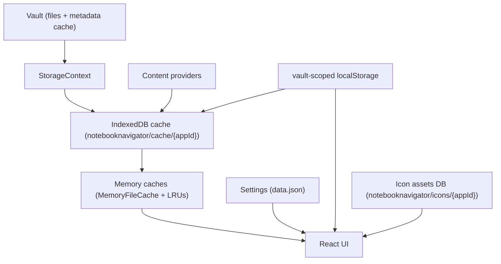

# Notebook Navigator Storage Architecture

Updated: February 18, 2026

## Table of Contents

- [Overview](#overview)
- [Storage Containers](#storage-containers)
  - [IndexedDB](#1-indexeddb-persistent-local-storage)
  - [Local Storage](#2-local-storage-persistent-local-storage)
  - [Memory Cache](#3-memory-cache-temporary-storage)
  - [Settings](#4-settings-synchronized-storage)
  - [Icon Assets Database](#5-icon-assets-database-device-specific-storage)
- [Data Flow Patterns](#data-flow-patterns)
  - [Initial Load](#initial-load-cold-boot)
  - [File Change](#file-change-during-session)
  - [Settings Change](#settings-change)
  - [Cache Rebuild](#cache-rebuild-manual)
  - [UI State Change](#ui-state-change)
- [Hidden Pattern Rules](#hidden-pattern-rules)
- [Storage Selection Guidelines](#storage-selection-guidelines)
- [Performance Considerations](#performance-considerations)
- [Version Management](#version-management)

## Overview

Notebook Navigator stores user configuration in `data.json` and uses rebuildable caches for file-derived data.

- **Settings** (`data.json`): user configuration, vault profiles, appearance overrides, pinned notes, folder/tag/property metadata maps, and fallback file icon/color maps.
- **Vault-scoped local storage**: device-local UI state, recent notes/icons, and version/migration markers.
- **IndexedDB cache**: per-file records and derived content state, with separate stores for preview text and feature image blobs.
- **In-memory caches**: synchronous mirror of the IndexedDB main records and bounded LRUs for preview text and feature image blobs.
- **In-memory trees**: tag and property trees derived from cached markdown records for navigation and selection.
- **Icon assets database**: per-vault IndexedDB database for downloaded icon fonts and metadata.



## Storage Containers

### 1. IndexedDB (Persistent Local Storage)

**Purpose**: Stores rebuildable file-derived data on the current device (per vault).

**Location**: Browser IndexedDB storage (device-specific, vault-specific namespace)

**Synchronization**: Not synchronized. Each device maintains its own caches.

**Key space and stores**:

- Database name: `notebooknavigator/cache/{appId}`
- Namespace key: `appId` from Obsidian (vault-scoped) passed through `initializeDatabase(...)`.
- Keys: file paths (`TFile.path`) used as the IndexedDB keys across stores (the main record does not store the path).
- Object stores:
  - `keyvaluepairs`: main file records (`FileData`)
  - `filePreviews`: preview text strings (`string`)
  - `featureImageBlobs`: feature image blobs (`{ featureImageKey: string; blob: Blob }`)
- Indexes (main store): `mtime` and `tags` (`tags` is `multiEntry: true`)

**Data stored (main record)**:

- Vault mtime (`mtime`)
- Provider processed mtimes (`markdownPipelineMtime`, `tagsMtime`, `metadataMtime`, `fileThumbnailsMtime`)
- Derived fields:
  - Tags (`tags`)
  - Word count (`wordCount`)
  - Task counters (`taskTotal`, `taskUnfinished`)
  - Property pills (`properties`)
  - Preview state (`previewStatus`) with preview text stored in `filePreviews`
  - Feature image state (`featureImageStatus`, `featureImageKey`) with blobs stored in `featureImageBlobs` (`featureImage` is always `null` in the main record)
  - Frontmatter-derived metadata (`metadata.name`, `metadata.created`, `metadata.modified`, `metadata.icon`, `metadata.color`, `metadata.background`, `metadata.hidden`)

**Status and sentinel semantics**:

- `previewStatus`: `unprocessed` | `none` | `has`
- `featureImageStatus`: `unprocessed` | `none` | `has`
- `featureImageKey`:
  - `null`: not processed yet
  - `''`: processed and no reference selected
  - `f:<path>@<mtime>`, `e:<url>`, `y:<videoId>`, `x:<path>@<mtime>`: processed and reference selected
- `metadata.created` / `metadata.modified`:
  - `0`: field not configured
  - `-1`: parsing failed

**Lifecycle management**:

- `src/main.ts` initializes `localStorage` and schedules `initializeDatabase(appId, ...)` early in `Plugin.onload()`.
- `StorageContext` uses `useIndexedDBReady()` to gate work on `db.init()` completion.
- `IndexedDBStorage.init()` opens the database, runs `onupgradeneeded`, and hydrates the in-memory mirror by bulk-loading the
  main store in batches.
- `IndexedDBStorage.init()` also checks local version markers (`STORAGE_KEYS.databaseSchemaVersionKey`, `STORAGE_KEYS.databaseContentVersionKey`) and clears all stores when a rebuild is required (missing markers, schema downgrade, or content version mismatch).
- Preview text and feature image blobs are not hydrated on startup; they are loaded on demand and cached in bounded LRUs.
- `Plugin.onunload()` calls `shutdownDatabase()` to close the connection and clear in-memory caches.

**Implementation**: `src/storage/IndexedDBStorage.ts`, `src/storage/fileOperations.ts`

```typescript
export type FeatureImageStatus = 'unprocessed' | 'none' | 'has';
export type PreviewStatus = 'unprocessed' | 'none' | 'has';

export interface PropertyItem {
  fieldKey: string;
  value: string;
  valueKind?: 'string' | 'number' | 'boolean';
}

export interface FileData {
  mtime: number;

  markdownPipelineMtime: number;
  tagsMtime: number;
  metadataMtime: number;
  fileThumbnailsMtime: number;

  tags: string[] | null;
  wordCount: number | null;
  taskTotal: number | null;
  taskUnfinished: number | null;
  properties: PropertyItem[] | null;

  previewStatus: PreviewStatus;

  featureImage: Blob | null;
  featureImageStatus: FeatureImageStatus;
  featureImageKey: string | null;

  metadata: {
    name?: string;
    created?: number;
    modified?: number;
    icon?: string;
    color?: string;
    background?: string;
    hidden?: boolean;
  } | null;
}
```

### 2. Local Storage (Persistent Local Storage)

**Purpose**: Stores device-local state and small persisted values scoped to the current vault.

This includes UI state (pane sizes, selections, expansion state), recent notes/icons, local mirrors for selected settings,
and cache version/migration markers.

**Location**: Obsidian vault-scoped local storage (`app.loadLocalStorage()` / `app.saveLocalStorage()`), not browser `window.localStorage`.

**Synchronization**: Not synchronized. Each device maintains its own local state.

**Data stored (examples)**:

- Layout and UI state: pane width/height, section order, toolbar visibility, navigation/list sizing, selected and expanded items.
- UX preferences and toggles (stored under `STORAGE_KEYS.uxPreferencesKey`).
- Recent data: recent notes (per vault profile) and recent icons.
- Per-setting local mirrors for sync-mode settings (see "Sync modes and local mirrors" under Settings).
- Cache version markers: `STORAGE_KEYS.databaseSchemaVersionKey`, `STORAGE_KEYS.databaseContentVersionKey`.
- Cache rebuild notice marker: `STORAGE_KEYS.cacheRebuildNoticeKey`.
- Local storage schema marker: `STORAGE_KEYS.localStorageVersionKey` (`LOCALSTORAGE_VERSION` in `src/utils/localStorage.ts`).

**Key characteristics**:

- `localStorage.init(app)` must run before using the wrapper to avoid mixing values between vaults.
- Reads/writes are synchronous (Obsidian handles serialization and deserialization).
- Recent notes/icons are persisted with a ~1000ms debounce and flushed on shutdown (`RecentStorageService`).

**Implementation**: `src/types.ts` (`STORAGE_KEYS`), `src/utils/localStorage.ts`, `src/services/RecentStorageService.ts`

```typescript
export const STORAGE_KEYS: LocalStorageKeys = {
  expandedFoldersKey: 'notebook-navigator-expanded-folders',
  expandedTagsKey: 'notebook-navigator-expanded-tags',
  expandedPropertiesKey: 'notebook-navigator-expanded-properties',
  expandedVirtualFoldersKey: 'notebook-navigator-expanded-virtual-folders',
  selectedFolderKey: 'notebook-navigator-selected-folder',
  selectedPropertyKey: 'notebook-navigator-selected-property',
  selectedFileKey: 'notebook-navigator-selected-file',
  selectedFilesKey: 'notebook-navigator-selected-files',
  selectedTagKey: 'notebook-navigator-selected-tag',
  navigationPaneWidthKey: 'notebook-navigator-navigation-pane-width',
  navigationPaneHeightKey: 'notebook-navigator-navigation-pane-height',
  dualPaneOrientationKey: 'notebook-navigator-dual-pane-orientation',
  dualPaneKey: 'notebook-navigator-dual-pane',
  uiScaleKey: 'notebook-navigator-ui-scale',
  shortcutsExpandedKey: 'notebook-navigator-shortcuts-expanded',
  recentNotesExpandedKey: 'notebook-navigator-recent-notes-expanded',
  recentNotesKey: 'notebook-navigator-recent-notes',
  recentIconsKey: 'notebook-navigator-recent-icons',
  navigationSectionOrderKey: 'notebook-navigator-section-order',
  pinnedShortcutsMaxHeightKey: 'notebook-navigator-pinned-shortcuts-max-height',
  uxPreferencesKey: 'notebook-navigator-ux-preferences',
  fileCacheKey: 'notebook-navigator-file-cache',
  databaseSchemaVersionKey: 'notebook-navigator-db-schema-version',
  databaseContentVersionKey: 'notebook-navigator-db-content-version',
  cacheRebuildNoticeKey: 'notebook-navigator-cache-rebuild-notice',
  localStorageVersionKey: 'notebook-navigator-localstorage-version',
  vaultProfileKey: 'notebook-navigator-vault-profile',
  releaseCheckTimestampKey: 'notebook-navigator-release-check-timestamp',
  latestKnownReleaseKey: 'notebook-navigator-latest-known-release',
  searchProviderKey: 'notebook-navigator-search-provider',
  folderSortOrderKey: 'notebook-navigator-folder-sort-order',
  tagSortOrderKey: 'notebook-navigator-tag-sort-order',
  propertySortOrderKey: 'notebook-navigator-property-sort-order',
  recentColorsKey: 'notebook-navigator-recent-colors',
  paneTransitionDurationKey: 'notebook-navigator-pane-transition-duration',
  toolbarVisibilityKey: 'notebook-navigator-toolbar-visibility',
  useFloatingToolbarsKey: 'notebook-navigator-use-floating-toolbars',
  pinNavigationBannerKey: 'notebook-navigator-pin-navigation-banner',
  navIndentKey: 'notebook-navigator-nav-indent',
  navItemHeightKey: 'notebook-navigator-nav-item-height',
  navItemHeightScaleTextKey: 'notebook-navigator-nav-item-height-scale-text',
  calendarPlacementKey: 'notebook-navigator-calendar-placement',
  calendarLeftPlacementKey: 'notebook-navigator-calendar-left-placement',
  calendarWeeksToShowKey: 'notebook-navigator-calendar-weeks-to-show',
  compactItemHeightKey: 'notebook-navigator-compact-item-height',
  compactItemHeightScaleTextKey: 'notebook-navigator-compact-item-height-scale-text'
};
```

### 3. Memory Cache (Temporary Storage)

**Purpose**: Provides synchronous access to cached file records during rendering and keeps derived-content payloads out of
React render paths.

**Location**: JavaScript heap memory (per session)

**Synchronization**: Owned by `IndexedDBStorage` and updated after successful IndexedDB writes.

**Data stored**:

- `MemoryFileCache`: `Map<path, FileData>` plus a bounded LRU for preview text strings.
- `FeatureImageBlobStore`: bounded LRU for thumbnail blobs keyed by path (validated against `featureImageKey`), plus in-flight read deduplication.

**Key characteristics**:

- Hydrated from `keyvaluepairs` during `IndexedDBStorage.init()` (bulk-loaded in batches).
- Preview text is loaded into the in-memory LRU via `ensurePreviewTextLoaded(path)` and optionally warmed in the background via
  `startPreviewTextWarmup()`.
- Feature image blobs are loaded via `getFeatureImageBlob(path, expectedKey)`. The key is used to avoid returning a thumbnail
  for an older reference.
- Cleared when the plugin reloads, when `IndexedDBStorage.clear()` runs, or when the database connection changes.

**Implementation**: `src/storage/MemoryFileCache.ts`, `src/storage/PreviewTextCache.ts`, `src/storage/FeatureImageBlobStore.ts`

### 4. Settings (Synchronized Storage)

**Purpose**: Stores user configuration and vault-scoped metadata that the plugin needs to restore deterministically.

**Location**: `.obsidian/plugins/notebook-navigator/data.json`

**Synchronization**: Synchronized by Obsidian Sync (when enabled) and by any other vault/file synchronization method.

**Data stored (high level)**:

- Vault profiles (`vaultProfiles`) with hidden patterns, banners, and shortcuts.
- Feature toggles and UI configuration (folders/tags behavior, list layout, note preview/feature image options, formatting).
- Folder/tag/property metadata maps in settings: icons, colors, background colors, sort overrides, and appearance overrides.
- File icon/color settings maps (`fileIcons`, `fileColors`) used as fallback and migration sources when frontmatter metadata writes are unavailable.
- Pinned notes (`pinnedNotes`) keyed by file path with separate `folder` / `tag` / `property` contexts.
- External icon provider enablement (`externalIconProviders`) and keyboard shortcut configuration (`keyboardShortcuts`).
- Runtime metadata maps and ordering: navigation separators, root folder/tag/property order, custom vault name, recent user colors, release tracking.

#### Sync modes and local mirrors

Some settings can be switched between **synced** (stored in `data.json`) and **local** (stored in vault-scoped local storage).
The selection is stored in `settings.syncModes` and resolved during `loadSettings()` using `src/services/settings/syncModeRegistry.ts`.

Local-sync-mode settings are sourced from local storage keys (in `STORAGE_KEYS`) and mirrored back to local storage even when
the setting is synced so the rest of the UI can read a single source.

See `SYNC_MODE_SETTING_IDS` in `src/settings/types.ts` for the full list (includes: `vaultProfile`, `tagSortOrder`, `searchProvider`,
`includeDescendantNotes`, `dualPane`, `dualPaneOrientation`, `paneTransitionDuration`, `toolbarVisibility`, `pinNavigationBanner`,
`showCalendar`, `navIndent`, `navItemHeight`, `navItemHeightScaleText`, `calendarWeeksToShow`, `compactItemHeight`,
`compactItemHeightScaleText`, `uiScale`).

**Implementation**: `src/settings.ts`, `src/settings/types.ts`, `src/services/settings/syncModeRegistry.ts`

```typescript
export interface NotebookNavigatorSettings {
  vaultProfiles: VaultProfile[];
  vaultProfile: string;
  syncModes: Record<SyncModeSettingId, SettingSyncMode>;

  // ... settings omitted

  customVaultName: string;
  pinnedNotes: PinnedNotes;

  fileIcons: Record<string, string>;
  fileColors: Record<string, string>;
  folderIcons: Record<string, string>;
  folderColors: Record<string, string>;
  folderBackgroundColors: Record<string, string>;
  folderSortOverrides: Record<string, SortOption>;
  folderAppearances: Record<string, FolderAppearance>;

  tagIcons: Record<string, string>;
  tagColors: Record<string, string>;
  tagBackgroundColors: Record<string, string>;
  tagSortOverrides: Record<string, SortOption>;
  tagAppearances: Record<string, TagAppearance>;
  propertyIcons: Record<string, string>;
  propertyColors: Record<string, string>;
  propertyBackgroundColors: Record<string, string>;
  propertyTreeSortOverrides: Record<string, AlphaSortOrder>;

  navigationSeparators: Record<string, boolean>;
  userColors: string[];
  rootFolderOrder: string[];
  rootTagOrder: string[];
  rootPropertyOrder: string[];
}
```

### 5. Icon Assets Database (Device-Specific Storage)

**Purpose**: Stores downloaded icon fonts and metadata manifests in a per-vault IndexedDB database.

**Location**: Browser IndexedDB storage (device-specific, vault-specific namespace)

**Synchronization**: Not synchronized. Each device downloads and caches its own icon packs.

**Data stored**:

- Font data (`ArrayBuffer`) and MIME type
- Metadata manifest payload (`metadata` as a JSON string) and format indicator (`metadataFormat`)
- Provider version and `updated` timestamp

**Key characteristics**:

- Database name: `notebooknavigator/icons/{appId}`
- Object store: `providers` keyed by `id` (one record per provider)
- Separate from the main cache database (`notebooknavigator/cache/{appId}`)

**Available icon providers**: Bootstrap Icons, Font Awesome, Material Icons, Phosphor Icons, RPG Awesome, Simple Icons

**Implementation**: `src/services/icons/external/IconAssetDatabase.ts`, `src/services/icons/external/providerRegistry.ts`

```typescript
export interface IconAssetRecord {
  id: string;
  version: string;
  mimeType: string;
  data: ArrayBuffer;
  metadataFormat: 'json';
  metadata: string;
  updated: number;
}
```

## Data Flow Patterns

### Initial Load (Cold Boot)

1. `localStorage.init(app)` runs early in `Plugin.onload()` so version checks and local mirrors are vault-scoped.
2. `initializeDatabase(appId, ...)` schedules `IndexedDBStorage.init()` and starts preview text warmup (idempotent).
3. `IndexedDBStorage.init()` compares local schema/content version markers with `DB_SCHEMA_VERSION` / `DB_CONTENT_VERSION` and clears the cache when a rebuild is required.
4. Settings are loaded from `data.json`, and sync-mode settings are resolved/mirrored via the sync-mode registry.
5. When a navigator view mounts, `StorageContext` waits for `useIndexedDBReady()` before doing cache work.
6. If `IndexedDBStorage` marked a pending rebuild notice (schema downgrade/content version mismatch), `useStorageVaultSync` starts a rebuild progress notice.
7. `useStorageVaultSync` diffs indexable vault files (`markdown` plus PDFs when enabled) against the in-memory cache (`calculateFileDiff()`),
   then writes additions/updates/removals to IndexedDB (`recordFileChanges()`, `removeFilesFromCache()`).
8. Tag and property trees are rebuilt from database records (`buildTagTreeFromDatabase()`, `buildPropertyTreeFromDatabase()`), filtered to currently visible markdown paths.
9. Content providers queue derived content work (previews, tags, metadata, task counters, properties, feature images, PDF thumbnails for PDF files) while the UI renders from the in-memory cache.
10. Metadata-dependent providers (markdown pipeline, tags, metadata) are queued through `useMetadataCacheQueue` so they only run after `app.metadataCache` has entries for the files.
11. If rebuild notice state exists in local storage (`STORAGE_KEYS.cacheRebuildNoticeKey`) and there is still pending work, `StorageContext` restores the rebuild progress notice after storage becomes ready.

### File Change (During Session)

1. Obsidian emits vault events (create, delete, rename, modify) and metadata cache events (`metadataCache.on('changed')` for markdown files).
2. Vault events are debounced (`TIMEOUTS.FILE_OPERATION_DELAY`) and collapsed into a single diff pass.
3. StorageContext runs `calculateFileDiff()` and updates IndexedDB:
   - Adds new records with default provider state
   - Updates `mtime` for modified files without clearing provider-owned fields
   - Removes deleted records
   - Preserves cached data across renames by seeding the new path with the previous record and moving preview/blob keys
4. For metadata cache changes that do not produce a vault `modify` event, StorageContext can reset provider processed mtimes (`markFilesForRegeneration()`) to force reprocessing against the updated metadata cache.
5. Content providers queue affected files for regeneration as needed (with `useMetadataCacheQueue` gating metadata-dependent types).
6. Providers write derived content through `IndexedDBStorage`, which updates the in-memory cache and emits change events for UI consumers.
7. Tag and property trees are rebuilt when affected data or visibility rules change.

### Settings Change

1. The settings UI updates the in-memory settings object and persists to `data.json`.
2. `SettingsContext` broadcasts updates to the React tree.
3. `useStorageSettingsSync` debounces changes and handles two categories:
   - Provider-relevant settings: forwarded to `ContentProviderRegistry.handleSettingsChange()` and used to queue regeneration.
   - Exclusion settings:
     - Hidden folders / hidden file properties trigger a diff resync so cached file lists and trees reflect the new rules.
     - Hidden file names / hidden file tags trigger tree rebuilds (database records are unchanged).
4. When provider settings changes trigger regeneration across many files, `useStorageSettingsSync` can start a rebuild progress notice and persist notice state in local storage (`STORAGE_KEYS.cacheRebuildNoticeKey`, `source: 'settings'`).
5. Content providers regenerate derived content in the background while the UI continues rendering from cached data.

### Cache Rebuild (Manual)

`StorageContext.rebuildCache()` (invoked by the rebuild-cache command/API) runs an exclusive rebuild sequence:

1. Stops background work: vault sync timers, tag rebuild debouncers, metadata waits, and content provider queues.
2. Clears IndexedDB stores (`IndexedDBStorage.clearDatabase()` / `IndexedDBStorage.clear()`), which also resets the in-memory caches.
3. Resets tag/property tree state and marks storage as not ready.
4. Persists rebuild notice state in local storage (`STORAGE_KEYS.cacheRebuildNoticeKey`, `source: 'rebuild'`) so a rebuild notice can be restored after a restart.
5. Re-runs the initial diff + queue process.

### UI State Change

1. UI interactions update local component state and write device-local values to vault-scoped local storage.
2. Recent notes and recent icons are persisted with a debounce (`RecentStorageService`).
3. Sync-mode settings update local storage mirrors and (when synced) persist changes to `data.json`.

## Hidden Pattern Rules

Hidden patterns live in the active vault profile (`VaultProfile`) and influence which files/tags/properties are visible and how tree counts are computed.

Implementation references:

- Folder path patterns: `src/utils/vaultProfiles.ts`, `src/utils/pathPatternMatcher.ts`
- File visibility filters (folders, file names, file tags, properties): `src/utils/fileFilters.ts`
- Tag hiding patterns: `src/utils/tagPrefixMatcher.ts`, `src/utils/pathPatternMatcher.ts`

### Folder patterns (`hiddenFolders`)

- **Name patterns** (no leading `/`): match individual folder names case-insensitively.
  - Supported forms: exact, `prefix*`, `*suffix` (wildcards in the middle / multiple wildcards are treated as literals)
- **Path patterns** (leading `/`): match normalized folder paths using path segments.
  - Segment types: literal (`Projects`), wildcard (`*`), prefix (`prefix*`)
  - `/Projects/*` matches descendants of `/Projects` but not `/Projects` itself.
  - `/Projects*` matches `/Projects` and any path segment starting with `Projects`.

### Tag patterns (`hiddenTags`)

- Normalization: remove a leading `#`, trim slashes, and lowercase.
- Path patterns support the same segment matcher as folders (literal, `*`, `prefix*`).
  - `projects` hides `projects` and descendants (`projects/client`).
  - `projects/*` hides descendants but keeps `projects` visible.
- Name patterns support `prefix*` and `*suffix` against the final tag name at any depth.
  - `temp*` hides tag names starting with `temp` at any depth (`projects/temp-note`).
  - `*draft` hides tag names ending with `draft` at any depth.
  - Patterns with multiple wildcards or wildcards in the middle of a segment are ignored.

### Hidden file name patterns (`hiddenFileNames`)

- Case-insensitive matching against:
  - file name (`file.name`)
  - base name (`file.basename`)
  - extension literals (`.pdf`, `.md`, etc)
  - path patterns (strings containing `/` are treated as paths)
- `*` wildcards are supported in name and path patterns. Multiple `*` wildcards are allowed.

### Hidden file property patterns (`hiddenFileProperties`)

- Case-insensitive list of frontmatter keys.
- Applies to markdown files (`.md`) only.
- A file is hidden when any of the configured keys exist in frontmatter (the value is ignored).

### Hidden file tag patterns (`hiddenFileTags`)

- Uses the same tag matcher as `hiddenTags`.
- Applies to markdown files only.
- A file is hidden when any tag matches a hidden tag rule (tags are read from `metadataCache` and/or cached tag extraction).

### Indexing vs visibility

The database indexes supported files regardless of the current "show hidden items" toggle:

- `getIndexableFiles()` always includes hidden items (so toggling visibility does not require rebuilding IndexedDB).
- Tag/property trees and counts are built from the database but filtered to the currently visible markdown set.

## Storage Selection Guidelines

### Use IndexedDB When:

- Storing file-derived data that can be regenerated
- Storing per-file payloads (records, preview strings, blobs)
- Data should remain device-local

### Use Local Storage When:

- Storing device-local view state and small persisted values
- Storing local mirrors for sync-mode settings
- Storing version markers and migration state

### Use Memory Cache When:

- Data must be available synchronously for rendering
- Data is already backed by IndexedDB and needs an in-memory mirror
- Payloads should not be read asynchronously in render paths

### Use Settings When:

- Data configures plugin behavior and should be persisted with the vault
- Data should participate in vault-level synchronization
- Data is JSON-serializable and fits within expected settings size

### Use Icon Assets Database When:

- Storing icon font binaries and provider metadata
- Data is too large for `data.json`
- Content can be re-downloaded per device

## Performance Considerations

### IndexedDB

- Main store hydration loads records in batches to limit peak allocations during startup.
- Preview text loads are batched and deduplicated (`ensurePreviewTextLoaded` queue + max batch).
- Feature image blob reads use a bounded LRU and per-path invalidation keyed by `featureImageKey`.

### Local Storage

- Write frequency is kept low for frequently updated keys (recent notes/icons are debounced).
- Stored values are sanitized/normalized on load (recent notes and icon maps).

### Memory Cache

- Memory footprint grows with file count and the configured LRU sizes.
- Caches are cleared when the database connection is reopened or cleared.

### Settings

- Large record maps (icons/colors/appearances) are updated on rename/delete to keep keys aligned with vault paths.
- Sync-mode settings are mirrored to local storage so UI reads a vault-scoped device-local value regardless of sync mode.

## Version Management

### Version Markers and Rebuild Notices

Notebook Navigator tracks two cache versions:

- **Schema** (`DB_SCHEMA_VERSION`): IndexedDB structure version (passed to `indexedDB.open(...)`).
- **Content** (`DB_CONTENT_VERSION`): derived content format version (plugin-defined).

`IndexedDBStorage.init()` stores the current versions in vault-scoped local storage:

- `STORAGE_KEYS.databaseSchemaVersionKey`
- `STORAGE_KEYS.databaseContentVersionKey`

Initialization behavior:

- Missing version keys trigger a full cache clear so the cache is rebuilt.
- Schema downgrades and content version mismatches set a pending rebuild notice (`consumePendingRebuildNotice()`), which is used by `StorageContext` to start a rebuild progress notice.
- IndexedDB open failures (including `VersionError`) can trigger a database delete + recreate and a cache rebuild.

### Schema Changes

When IndexedDB schema changes:

1. Increment `DB_SCHEMA_VERSION` in `src/storage/IndexedDBStorage.ts`.
2. Schema upgrades run via `onupgradeneeded` (may clear stores when legacy payloads cannot be migrated).
3. Schema downgrades delete and recreate the database.

### Content Format Changes

When derived content format changes:

1. Increment `DB_CONTENT_VERSION` in `src/storage/IndexedDBStorage.ts`.
2. Stores are cleared (`IndexedDBStorage.clear()`).
3. Content providers regenerate derived content for all files during background processing.

Current values: `DB_SCHEMA_VERSION = 3`, `DB_CONTENT_VERSION = 4`.

### Settings Updates

When settings structure changes:

1. Load existing settings (`loadSettings()`).
2. Apply migrations and defaults.
3. Persist the updated structure back to `data.json`.

### Local Storage Updates

When local storage keys or formats change:

1. Normalize or migrate stored values on load.
2. Update `LOCALSTORAGE_VERSION` (`src/utils/localStorage.ts`) so migrations run once per vault.
